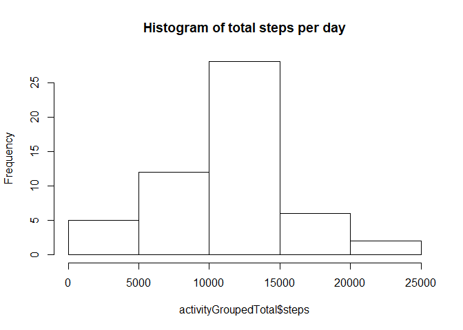
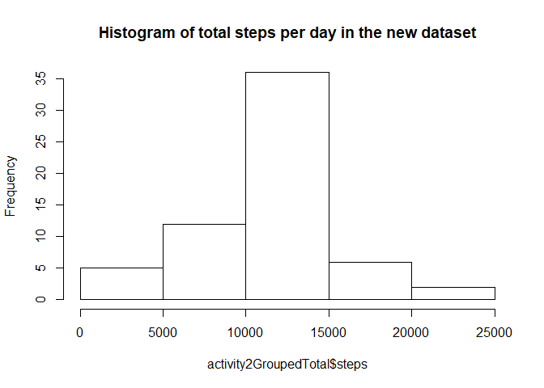
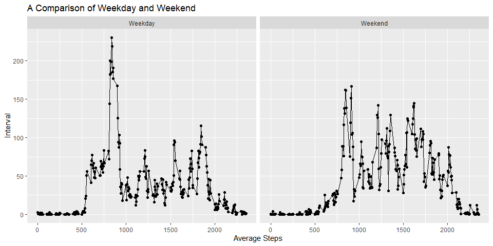

## Loading and preprocessing the data

```r
# Reading the file.
activity <- read.csv("activity.csv")

# Changing the date column's type to "Date"
activity$date <- as.Date(activity$date, format = "%Y-%m-%d")
```

## What is mean total number of steps taken per day?

```r
# Calculate the total number of steps taken per day
library(dplyr)
```

```
## 
## Attaching package: 'dplyr'
```

```
## The following objects are masked from 'package:stats':
## 
##     filter, lag
```

```
## The following objects are masked from 'package:base':
## 
##     intersect, setdiff, setequal, union
```

```r
activityGroupedTotal <- activity %>% group_by(date) %>% 
  summarise(across(everything(), sum))
```

```
## `summarise()` ungrouping output (override with `.groups` argument)
```

```r
head(activityGroupedTotal)
```

```
## # A tibble: 6 x 3
##   date       steps interval
##   <date>     <int>    <int>
## 1 2012-10-01    NA   339120
## 2 2012-10-02   126   339120
## 3 2012-10-03 11352   339120
## 4 2012-10-04 12116   339120
## 5 2012-10-05 13294   339120
## 6 2012-10-06 15420   339120
```


```r
# Make a histogram of the total number of steps taken each day
hist(activityGroupedTotal$steps, main = "Histogram of total steps per day")
```

<!-- -->


```r
# Calculate and report the mean and median of the total number of steps taken per day
cat("Mean of the total number of steps taken per day", mean(activityGroupedTotal$steps, na.rm = TRUE), "\n")
```

```
## Mean of the total number of steps taken per day 10766.19
```

```r
cat("Median of the total number of steps taken per day",
median(activityGroupedTotal$steps, na.rm = TRUE))
```

```
## Median of the total number of steps taken per day 10765
```


## What is the average daily activity pattern?

```r
# Make a time series plot (i.e. type = "l") of the 5-minute interval (x-axis) and the average number of steps taken, averaged across all days (y-axis)
activityGroupedAverage <- activity %>% group_by(interval) %>% 
  summarise(steps = mean(steps, na.rm=TRUE))
```

```
## `summarise()` ungrouping output (override with `.groups` argument)
```

```r
plot(activityGroupedAverage$interval, activityGroupedAverage$steps, type = "l", xlab = "Interval", ylab = "Average Steps")
```

<!-- -->


```r
# Which 5-minute interval, on average across all the days in the dataset, contains the maximum number of steps?

cat("Interval that contains maximum steps: ",
activityGroupedAverage[activityGroupedAverage$steps >= max(activityGroupedAverage$steps, na.rm = TRUE),]$interval, "\n")
```

```
## Interval that contains maximum steps:  835
```

```r
cat("Steps: ",
max(activityGroupedAverage$steps, na.rm = TRUE))
```

```
## Steps:  206.1698
```


## Imputing missing values

```r
# Calculate and report the total number of missing values in the dataset (i.e. the total number of rows with NAs)
summary(activity)
```

```
##      steps             date               interval     
##  Min.   :  0.00   Min.   :2012-10-01   Min.   :   0.0  
##  1st Qu.:  0.00   1st Qu.:2012-10-16   1st Qu.: 588.8  
##  Median :  0.00   Median :2012-10-31   Median :1177.5  
##  Mean   : 37.38   Mean   :2012-10-31   Mean   :1177.5  
##  3rd Qu.: 12.00   3rd Qu.:2012-11-15   3rd Qu.:1766.2  
##  Max.   :806.00   Max.   :2012-11-30   Max.   :2355.0  
##  NA's   :2304
```

```r
#Devise a strategy for filling in all of the missing values in the dataset. The strategy does not need to be sophisticated. For example, you could use the mean/median for that day, or the mean for that 5-minute interval, etc.

#Create a new dataset that is equal to the original dataset but with the missing data filled in.
activity2 <- activity

# Filling the NAs with average of its interval in the new dataset.
for(i in 1:nrow(activity2)){
  ifelse(is.na(activity2[i,1]), activity2[i, 1] <- activityGroupedAverage[activityGroupedAverage$interval == activity2[i,3],]$steps, i)}
```


```r
# Make a histogram of the total number of steps taken each day and Calculate and report the mean and median total number of steps taken per day. Do these values differ from the estimates from the first part of the assignment? What is the impact of imputing missing data on the estimates of the total daily number of steps?
activity2GroupedTotal <- activity2 %>% group_by(date) %>% 
  summarise(across(everything(), sum))
```

```
## `summarise()` ungrouping output (override with `.groups` argument)
```

```r
hist(activity2GroupedTotal$steps, main = "Histogram of total steps per day in the new dataset")
```

<!-- -->


```r
cat("Mean of the total number of steps taken per day in the new dataset", mean(activity2GroupedTotal$steps, na.rm = TRUE), "\n")
```

```
## Mean of the total number of steps taken per day in the new dataset 10766.19
```

```r
cat("Median of the total number of steps taken per day in the new dataset",
median(activity2GroupedTotal$steps, na.rm = TRUE), "\n")
```

```
## Median of the total number of steps taken per day in the new dataset 10766.19
```
### Median has changed in the new dataset compared to the original one

## Are there differences in activity patterns between weekdays and weekends?


```r
# Create a new factor variable in the dataset with two levels – “weekday” and “weekend” indicating whether a given date is a weekday or weekend day.
#weekdays1 <- c('Monday', 'Tuesday', 'Wednesday', 'Thursday', 'Friday')
#activity2$wDay <- factor((weekdays(activity2$date) %in% weekdays1), 
#         levels=c(FALSE, TRUE), labels=c('weekend', 'weekday'))

library(chron)
activity2$wDay <- factor(ifelse(is.weekend(activity2$date), "Weekend", "Weekday"))
```


```r
# Make a panel plot containing a time series plot (i.e. type = "l") of the 5-minute interval (x-axis) and the average number of steps taken, averaged across all weekday days or weekend days (y-axis).
activity2GroupedWeek <- activity2 %>% group_by(wDay, interval) %>% 
  summarise(steps = mean(steps))
```

```
## `summarise()` regrouping output by 'wDay' (override with `.groups` argument)
```

```r
library(ggplot2)
qplot(interval, steps, data = activity2GroupedWeek,
      facets = . ~ wDay,
      xlab = "Average Steps", ylab = "Interval",
      main = "A Comparison of Weekday and Weekend") + geom_line(aes(group = "1"), col = "black")
```

<!-- -->
